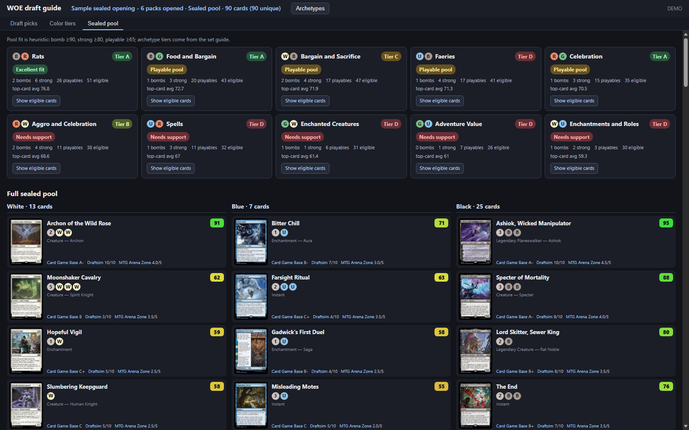
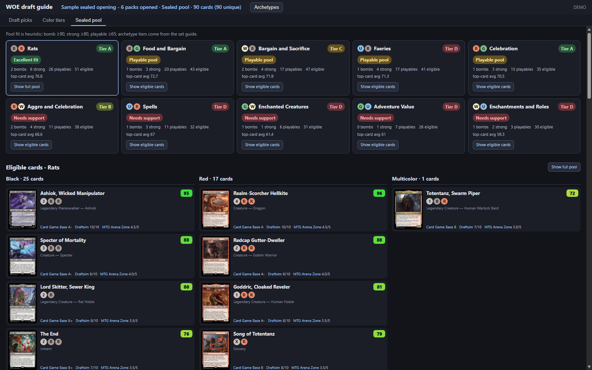

# Arena draft guide (any draft set)

A local, auto-refreshing web page for a second monitor. While you draft in MTG Arena it shows the cards in your current pack with card art and draft ratings. Reality Fracture combines grades from multiple Limited reviewers; every other set automatically tries Card Game Base, Draftsim, MTG Arena Zone and 17Lands (URLs are guessed from the set name via Scryfall, so sources without a page for the set are skipped).

## Run

Python 3.12+, standard library only (no installs).

    py -3.12 -m draftguide            # then open http://127.0.0.1:8765
    py -3.12 -m draftguide --demo     # sample pack, no Arena needed

Options: `--log PATH` (default: Arena's `Player.log`), `--card-db PATH` (auto-detected in Steam/Wizards install folders, or env `MTGA_CARD_DB`), `--port`, `--refresh-ratings`.

In Arena: Options > Account > enable **Detailed Logs (Plugin Support)**, then restart Arena. Without it Arena doesn't log draft packs.

## How it works

- Read-only: tails `Player.log` for `DraftPack` payloads (Quick and Premier draft share this same code path; Traditional and Pick-Two use it too) and, as a fallback, `Draft.Notify` `PackCards` lines; maps Arena card ids to names from the game's local card database (opened read-only). No input is sent to Arena, no memory or network access to the game.
- Draft pack/pick observations and complete sealed card pools are archived locally in `%LOCALAPPDATA%\ArenaDraftGuide\history.sqlite3` (or `~/.local/share/ArenaDraftGuide/history.sqlite3` on other platforms), outside the repository. The **History** tab shows all inferred draft picks as compact, color-sorted stacks that expand on hover or focus above the step-by-step pack replay, and opens saved sealed pools. When a booster returns after the table pass, cards absent from the returned pack are shown grey unless the log indicates they were your pick. The archive starts with observations available in Arena's current `Player.log`; it cannot recover logs that Arena has already cleared.
- To preview the History tab without Arena or changing your personal archive, start the guide and open [`/history-sample.html`](http://127.0.0.1:8765/history-sample.html). The sample page uses the production History renderer with a shuffled mix of 45 different WOE cards across three 15-pick packs and fictional grades; select the draft entry to try replay controls or the sealed entry to inspect a sample pool.
- Ratings are cached as per-set JSON files under `data/` (git-ignored, not redistributed). FRA's feed includes Draftsim, MTG Arena Zone, Card Game Base, and other reviewers. WOE combines Card Game Base letter grades, Draftsim 0–10 grades, and MTG Arena Zone 0–5 grades; available 17Lands data is also shown separately from the reviewer consensus. Individual native grades and source links appear alongside the consensus score. Ratings refresh every 12 hours; use `--refresh-ratings` to fetch them again. Card images load from Scryfall in your browser.
- Curated Limited archetype guides are stored as `guides/archetypes/<SET>.json`, separately from the ignored rating cache. During a draft, use **Color tiers** for the sorted color-pair ratings, or toggle the **Archetypes** sidebar for themes and sources. Guide JSON is reloaded when its file changes. Archetypes with a `tier` value sort highest-first; entries without a tier remain at the end.
- When Arena logs a sealed course's `CardPool`, the guide opens a **Sealed pool** view with the complete pool grouped by color and showing available card grades. It compares each two-color pool against its set archetype tier and summarizes bombs (score 90+), strong cards (80+), and playables (65+). Each archetype's **Show eligible cards** button filters the pool to that color pair; **Show full pool** restores it. Those thresholds and deck-fit labels are heuristics, not deck recommendations; colorless spells count toward every pair, multicolor cards only count when all their colors fit, and lands are excluded from archetype counts.
- The FRA feed currently exposes per-card grades for Draftsim, MTG Arena Zone, Card Game Base, and additional reviewers. The supplied Untapped.gg and TCGplayer pages do not provide ratings through this feed and are not included.
- The page polls `/api/state` every second and redraws when a new pack arrives.

## Limits

- Works for any set: the set and format are read from the draft's event name (Premier/Quick/Traditional) and, in games, from the expansion codes in your deck. FRA combines available numeric grades from the multi-source feed and shows each original reviewer grade in `data/multi-source-FRA.json`. WOE combines Card Game Base, Draftsim, and MTG Arena Zone grades, averages those normalized reviewer scores, and shows each source's native scale; it also adds 17Lands' empirical grade when that endpoint has usable data. Combined data is cached by format in `data/multi-source-WOE-<format>.json`, with individual source caches alongside it. For any other set the reviewer pages above are discovered from the set name and combined the same way; if none exist, 17Lands win-rate data is used alone (score = percentile of games-in-hand win rate among cards with 200+ games, cached in `data/17l-<SET>-<format>.json` for 12h). Cards without an available review grade appear unrated; cards without enough statistical data show "Not enough data" with art and mana cost. If a source is unreachable, cached ratings are used when available, otherwise its grades are omitted and the server logs a warning. 17Lands may have no current data for older sets or brand-new sets; only FRA packs have been seen live, and other sets are covered by unit tests and a simulated FDN draft (`python tools/simulate_draft.py --log X --set FDN`).
- Log parsing was replayed line-by-line against real public Arena logs (Quick and Premier drafts, the formats this tool targets, from andreagrandi/draftomen test fixtures): every pick produced a refreshed pack (14, 13, 12... cards) and Quick Draft's completion cleared the pack. It has not yet been run against your own live Reality Fracture draft; if the page shows Waiting for a draft pack..., check Detailed Logs is enabled.
- Sealed-pool detection expects a logged sealed course response with an `InternalEventName` containing `Sealed` and at least 40 `CardPool` entries. This parser path has synthetic test coverage but has not yet been verified against a live Arena sealed log.
- Ratings are aggregated opinions, not a pick for you; the page doesn't account for your colors so far (possible next step: use `PickedCards`).

## Tests

    py -3.12 -m unittest discover -s tests -t .


## Game mode: library and draw chances

When a match starts, the page switches to a library view: every card still in
your library, its count and the chance to draw it next. Hovering a row shows
the card image from Scryfall. After the
game ends it falls back to the draft view.

How it works: the library is hidden in the log, so it is derived as your
deck list (from the GRE `ConnectResp`) minus your own cards seen in hand,
battlefield, graveyard, exile and stack. Printings are grouped by name. A
"?" warning shows if the derived size differs from Arena's library zone size
(tokens, stolen or copied cards can skew counts).

Limits: needs Detailed Logs enabled; tested on synthetic and old public GRE
fixtures only, not yet on a live modern match. A match joined mid-game has no
deck list, so no library view.

### Opponent instant-speed guide (bottom bar)

In game mode a bar at the bottom shows what the opponent could cast at instant
speed right now: it counts the opponent's untapped lands (basic type, or the
colour identity of non-basics), then lists (1) instants/flash cards they have
already shown (battlefield, graveyard, exile, stack) and (2) instants/flash creatures from the detected set
instant/flash cards in their colours that their untapped mana can pay for.
Greyed cards are shown but not currently affordable. Hover for a larger image.

Limits: the opponent's hand and deck are hidden, so "could have" is a pool
guess, not knowledge. Mana from creatures, treasures or other non-land sources
and X costs/cost reductions are not modelled; phyrexian mana is treated as free.

## Supplemental picklist ratings

The WOE and FRA Draftsim picklists are saved in `data/picklists/WOE.csv` and
`data/picklists/FRA.csv` (324 WOE rows and 295 FRA rows). The FRA source uses
`-1` for its five basic-land entries; those sentinel values are preserved in
the CSV but excluded from scored card ratings. Neither source supplied
card-specific comments, so those CSV cells are empty.

The distinct source ratings are normalized to 0-100 internally and averaged;
the card's leaf displays that mean on a 0-5 scale. 17Lands win-rate percentiles
are not included in this average. Other sets without supplemental picklists
continue using their configured rating provider. Each contributing source's
grade and optional comment is shown on the card, with a link to that source.
To add a source for an existing set, add rows to that set's CSV using:

```csv
source,card_name,rating,rating_scale,comment,source_url
```

Ratings are numeric and must be between zero and `rating_scale` (Draftsim
uses a 0-5 scale). Leave `comment` empty when the source has no card-specific
text; the card UI displays it when present. `source_url` preserves the
attribution for each row. When public ratings are unavailable, a local
picklist CSV is used as a fallback. The complete Draftsim pick-order page
catalog found in its sitemap is listed in
[`docs/DRAFTSIM_PICKLISTS.md`](docs/DRAFTSIM_PICKLISTS.md).

## Screenshots

The same demo pack with different rating sources selected from the header dropdown: Draftsim first, then Aggregated.


In-game mode on a real match: library with draw chances, mana costs and types, plus the opponent instant-speed bar:


Sealed mode with a sample six-pack, 90-card pool, and archetype fit summaries:



Selecting **Show eligible cards** replaces the full pool with cards that fit the chosen archetype:



### Try it without Arena

```
py -3.12 tools/simulate_draft.py --log sim.log --interval 4
py -3.12 -m draftguide --log sim.log --port 8780
```
## Untapped.gg pick order and tier list

For every set the server also tries Untapped.gg's pick-order page (cached in `data/untapped-pickorder-<SET>.json`) and limited tier-list page (`data/untapped-tiers-<SET>.json`). Each card gets a second leaf next to the aggregated score showing its Untapped pick-order rank within its rarity (so there is a #1 mythic, #1 rare, #1 uncommon and #1 common), an `ATA` rating line, and badges such as "#2 pick in R" or "#1 common in G" for the top cards per colour. Pick order is not averaged into the score. The tier list (colour-pair/wedge tiers, 6+ win rate) is overlaid on the archetype guide, or builds a basic one when a set has no curated guide. Both refresh when the cache is over a week old; failures fall back to the cached copy and are retried every 10 minutes.
