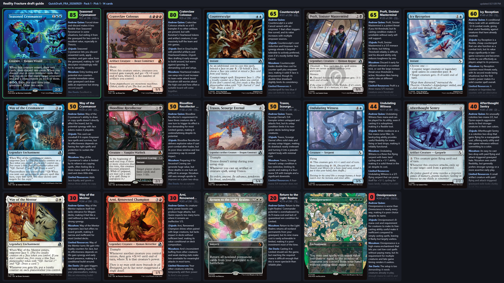
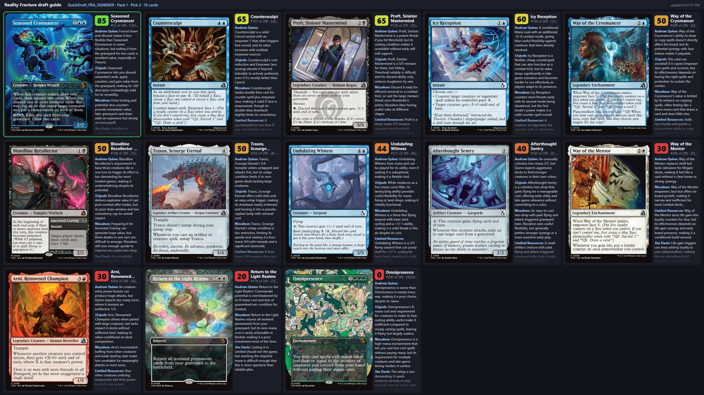
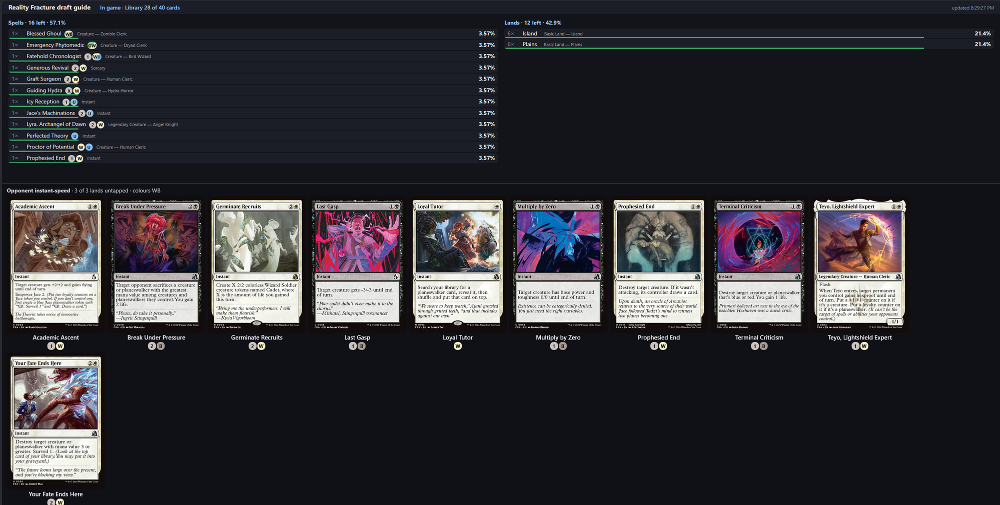

# Arena draft guide (Reality Fracture)

A local, auto-refreshing web page for a second monitor. While you draft in MTG Arena it shows the cards in your current pack with card art, aggregate rating, per-reviewer grades, and written comments/notes from [chunk.science's Reality Fracture tier list](https://chunk.science/mtga-reality-fracture.html). The best-rated card is outlined green and the pack is sorted best-first.

## Run

Python 3.12+, standard library only (no installs).

    py -3.12 -m draftguide            # then open http://127.0.0.1:8765
    py -3.12 -m draftguide --demo     # sample pack, no Arena needed

Options: `--log PATH` (default: Arena's `Player.log`), `--card-db PATH` (auto-detected in Steam/Wizards install folders, or env `MTGA_CARD_DB`), `--port`, `--refresh-ratings`.

In Arena: Options > Account > enable **Detailed Logs (Plugin Support)**, then restart Arena. Without it Arena doesn't log draft packs.

## How it works

- Read-only: tails `Player.log` for `DraftPack` payloads (Quick and Premier draft share this same code path; Traditional and Pick-Two use it too) and, as a fallback, `Draft.Notify` `PackCards` lines; maps Arena card ids to names from the game's local card database (opened read-only). No input is sent to Arena, no memory or network access to the game.
- Ratings are downloaded once from chunk.science into `data/fra.json` (git-ignored; the site is "all rights reserved", so the data is not redistributed here). Refresh with `--refresh-ratings`. Card images load from Scryfall in your browser.
- The page polls `/api/state` every second and redraws when a new pack arrives.

## Limits

- Only the Reality Fracture set is rated; cards not in it show "No rating found".
- Log parsing was replayed line-by-line against real public Arena logs (Quick and Premier drafts, the formats this tool targets, from andreagrandi/draftomen test fixtures): every pick produced a refreshed pack (14, 13, 12... cards) and Quick Draft's completion cleared the pack. It has not yet been run against your own live Reality Fracture draft; if the page shows Waiting for a draft pack..., check Detailed Logs is enabled.
- Ratings are aggregated opinions, not a pick for you; the page doesn't account for your colors so far (possible next step: use `PickedCards`).

## Tests

    py -3.12 -m unittest discover -s tests -t .


## Game mode: library and draw chances

When a match starts, the page switches to a library view: every card still in
your library, its count and the chance to draw it next. Hovering a row shows
the card image (Scryfall, or the chunk.science image for FRA cards). After the
game ends it falls back to the draft view.

How it works: the library is hidden in the log, so it is derived as your
deck list (from the GRE `ConnectResp`) minus your own cards seen in hand,
battlefield, graveyard, exile and stack. Printings are grouped by name. A
"?" warning shows if the derived size differs from Arena's library zone size
(tokens, stolen or copied cards can skew counts).

Limits: needs Detailed Logs enabled; tested on synthetic and old public GRE
fixtures only, not yet on a live modern match. A match joined mid-game has no
deck list, so no library view.

### Opponent instant-speed guide (bottom bar)

In game mode a bar at the bottom shows what the opponent could cast at instant
speed right now: it counts the opponent's untapped lands (basic type, or the
colour identity of non-basics), then lists (1) instants/flash cards they have
already shown (battlefield, graveyard, exile, stack) and (2) Reality Fracture
instant/flash cards in their colours that their untapped mana can pay for.
Greyed cards are shown but not currently affordable. Hover for a larger image.

Limits: the opponent's hand and deck are hidden, so "could have" is a pool
guess, not knowledge. Mana from creatures, treasures or other non-land sources
and X costs/cost reductions are not modelled; phyrexian mana is treated as free.

## Screenshots

Draft pick 1 of a simulated Quick Draft (`tools/simulate_draft.py`), then the next pick after a card is taken; the page refreshes by itself:




In-game mode on a real match: library with draw chances, mana costs and types, plus the opponent instant-speed bar:



### Try it without Arena

```
py -3.12 tools/simulate_draft.py --log sim.log --interval 4
py -3.12 -m draftguide --log sim.log --port 8780
```